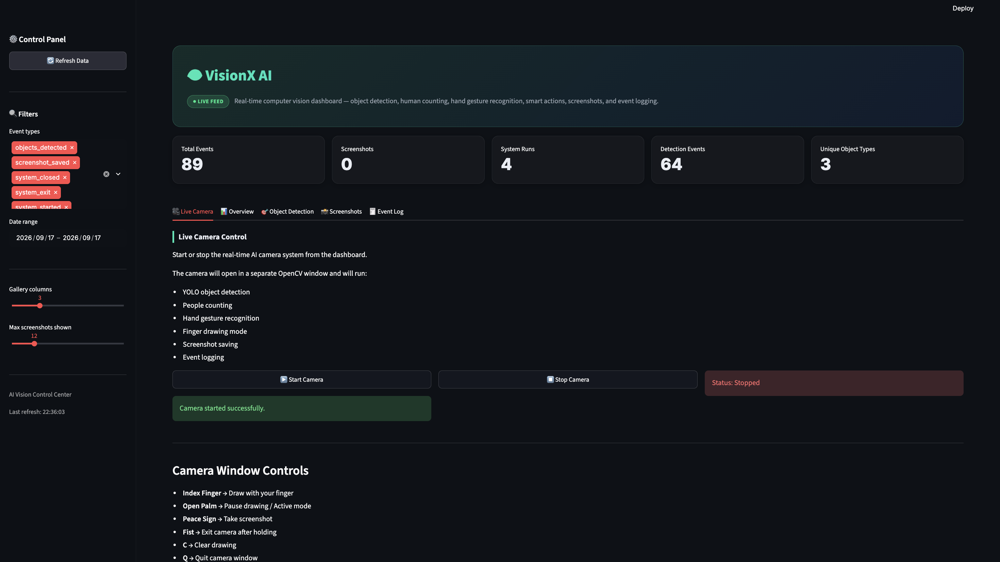

<div align="center">

# 👁️ VisionX AI

### Real-Time Computer Vision System — Object Detection · Gesture Control · Air Drawing · Recording · Analytics

<p>
  
  
  
  
  
</p>

<p>
  
  
  
</p>

</div>

---

## 📌 Overview

**AI Vision Control Center** is a real-time computer vision project that turns a normal webcam into an AI-powered control center.

The system combines **YOLO object detection**, **MediaPipe hand tracking**, **gesture recognition**, **finger air drawing**, **screenshot capture**, **video recording**, **event logging**, and a **Streamlit analytics dashboard**.

Users can interact with the camera using hand gestures, draw on the screen with their index finger, detect objects and people in real time, save screenshots, record videos, and analyze activity through a dashboard.

---

## 🖼️ Project Preview

<div align="center">



</div>

---

## ✨ Key Features

<table>
<tr>
<td width="50%" valign="top">

### 🎥 Real-Time Camera System

* Live webcam feed using OpenCV
* Real-time frame processing
* FPS counter
* Modern transparent HUD overlay
* Keyboard and gesture-based controls

### 🎯 Object Detection

* YOLO-based object detection
* Detects people, animals, and common objects
* Draws bounding boxes and confidence scores
* Counts people in real time
* Adjustable confidence threshold

</td>
<td width="50%" valign="top">

### ✍️ Finger Air Drawing

* Draw on screen using index finger
* Multiple brush colors
* Adjustable brush thickness
* Eraser mode
* Clear drawing shortcut
* Undo support

### 📸 Capture & Record

* Screenshot capture with flash effect
* Video recording support
* Automatic file saving
* Event logging for all actions
* Dashboard analytics

</td>
</tr>
</table>

---

## 🖐️ Hand Gesture Controls

| Gesture          | Action                      |
| ---------------- | --------------------------- |
| ✋ Open Palm      | Active mode / pause drawing |
| ☝️ Index Finger  | Draw on the screen          |
| ✌️ Peace Sign    | Save screenshot             |
| 👊 Fist          | Hold to exit camera         |
| 👍 Thumbs Up     | Change brush color          |
| 🤙 Call Me       | Toggle eraser mode          |
| 🤟 Three Fingers | Adjust brush size           |

---

## ⌨️ Keyboard Controls

| Key | Function                   |
| --- | -------------------------- |
| `Q` | Quit camera                |
| `C` | Clear drawing              |
| `Z` | Undo                       |
| `O` | Toggle object detection    |
| `H` | Show / hide hand landmarks |
| `R` | Start / stop recording     |
| `[` | Decrease YOLO confidence   |
| `]` | Increase YOLO confidence   |
| `+` | Increase brush thickness   |
| `-` | Decrease brush thickness   |

---

## 📊 Streamlit Dashboard

The dashboard provides a clean analytics interface for the camera system.

### Dashboard Features

| Section             | Description                                                   |
| ------------------- | ------------------------------------------------------------- |
| 🎥 Live Camera      | Start and stop the camera system                              |
| 📊 Overview         | Event charts and timeline                                     |
| 🎯 Object Detection | Object detection logs and top detected objects                |
| 📸 Screenshots      | Screenshot gallery                                            |
| 🧾 Event Log        | Searchable event log table with CSV export                    |
| ⚙️ Sidebar Filters  | Event type filter, date range, refresh button, gallery layout |

---

## 🧠 Tech Stack

| Category             | Tools              |
| -------------------- | ------------------ |
| Programming Language | Python 3.11        |
| Computer Vision      | OpenCV             |
| Object Detection     | YOLO / Ultralytics |
| Hand Tracking        | MediaPipe          |
| Data Processing      | Pandas, NumPy      |
| Dashboard            | Streamlit          |
| Visualization        | Plotly             |
| Logging              | CSV                |
| Version Control      | Git, GitHub        |

---

## 📁 Project Structure

```text
ai-vision-control-center/
│
├── dashboard/
│   └── app.py
│
├── src/
│   ├── 01_camera_test.py
│   ├── 02_yolo_object_detection.py
│   ├── 03_hand_gesture_detection.py
│   └── 04_ai_vision_control_center.py
│
├── assets/
│   └── dashboard-demo.png
│
├── screenshots/
├── recordings/
├── logs/
│
├── requirements.txt
├── .gitignore
└── README.md
```

---

## ⚙️ Installation

### 1. Clone the repository

```bash
git clone https://github.com/Nitishkumar1412/VisionX-AI
```

### 2. Create a virtual environment

```bash
python -m venv .venv311
```

### 3. Activate the virtual environment

#### Windows PowerShell

```powershell
.\.venv311\Scripts\activate
```

#### macOS / Linux

```bash
source .venv311/bin/activate
```

### 4. Install dependencies

```bash
pip install -r requirements.txt
```

---

## ▶️ How to Run

### Run the main AI camera system

```bash
python src/04_vision_x_ai.py
```

### Run the Streamlit dashboard

```bash
streamlit run dashboard/app.py
```

Then open:

```text
http://localhost:8501
```

---

## 📝 Event Logging

The system stores activity logs in:

```text
logs/vision_events.csv
```

Example logged events:

```text
system_started
objects_detected
screenshot_saved
recording_started
recording_stopped
drawing_cleared
detection_toggled
system_exit
system_closed
```

These logs are used by the Streamlit dashboard to generate charts, tables, and analytics.

---

## 📸 Screenshots and Recordings

Screenshots are saved in:

```text
screenshots/
```

Recordings are saved in:

```text
recordings/
```

Logs are saved in:

```text
logs/
```

These folders are usually ignored from GitHub to avoid uploading personal camera files.

---

## 📦 Requirements

Main libraries used:

```text
opencv-python
mediapipe
ultralytics
numpy
pandas
streamlit
plotly
matplotlib
```

To regenerate `requirements.txt`:

```bash
pip freeze > requirements.txt
```

---

## 🚀 Push to GitHub

### 1. Initialize Git

```bash
git init
```

### 2. Add files

```bash
git add .
```

### 3. Commit

```bash
git commit -m "Initial commit - AI Vision Control Center"
```

### 4. Connect to GitHub

Create a new GitHub repository named:

```text
Vision-X-AI
```

Then run:

```bash
git remote add origin https://github.com/Nitishkumar1412/VisionX-AI
git branch -M main
git push -u origin main
```


---

## ⚠️ Deployment Note

This project uses a local webcam through OpenCV. Because of that, the full real-time camera system should run locally on your machine.

GitHub is used to host the code and documentation. The Streamlit dashboard can be run locally, while live camera capture depends on local hardware access.

---

## 🔮 Future Improvements

* Face detection and face blur privacy mode
* Voice command support
* Improved gesture classification model
* Stroke-level undo system
* Auto-refreshing dashboard charts
* Multi-camera support
* Docker support
* Dashboard authentication
* Cloud dashboard for uploaded logs

---

## 👩‍💻 Author

**Nitish Kumar**

---

## ⭐ Project Status

| Component                  | Status      |
| -------------------------- | ----------- |
| Real-time camera           | ✅ Completed |
| YOLO object detection      | ✅ Completed |
| People counting            | ✅ Completed |
| Hand gesture recognition   | ✅ Completed |
| Finger air drawing         | ✅ Completed |
| Screenshot capture         | ✅ Completed |
| Video recording            | ✅ Completed |
| Event logging              | ✅ Completed |
| Streamlit dashboard        | ✅ Completed |
| GitHub-ready documentation | ✅ Completed |

<div align="center">

⭐ **If you like this project, consider giving it a star!** ⭐

</div>